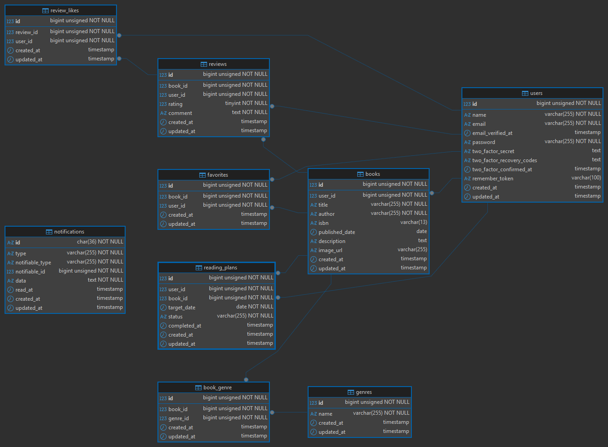

# BookShelf 書籍レビューアプリ

書籍の検索・レビュー投稿・読書計画管理・レポート分析など、  
読書体験をより豊かにするための Web アプリケーションです。  
Laravel / MySQL / Docker（Laravel Sail）を使用して構築されています。

## 概要

BookShelf は以下の機能を備えた書籍レビューアプリです。

- 書籍検索（Google Books API）
- レビュー投稿・編集・削除
- レビューへのいいね機能
- 読書計画（ReadingPlan）の作成・編集・削除
- 読書計画のリマインダー通知（Database Notification）
- 日次バッチ処理（Scheduler + Console Command）
- マイレポート（統計・評価分布・ジャンル傾向）
- 公開 API（Laravel Sanctum 認証）

## ER 図



## 環境構築手順（Laravel Sail）

1.  リポジトリをクローン

    ```bash
    git clone https://github.com/kayato109/bookshelf-app
    cd bookshelf-app
    ```

2.  .env を作成

    ```bash
    cp .env.example .env
    ```

    .env 内の DB 設定が以下になっていることを確認してください。

    ```ini
    DB_CONNECTION=mysql
    DB_HOST=mysql
    DB_PORT=3306
    DB_DATABASE=laravel
    DB_USERNAME=sail
    DB_PASSWORD=password
    ```

    ※ DB_HOST は localhost ではなく mysql（コンテナ名）を指定します。

3.  Google Books API キーを設定

    .envの最後の行に各自で取得したAPIキーを入力してください。

    ```ini
    GOOGLE_BOOKS_API_KEY = [取得したAPIキーを入力]
    ```

    ※Google Books API キー取得手順(https://developers.google.com/books/docs/v1/using?hl=ja)

4.  Composer依存パッケージのインストール

    プロジェクトの初回セットアップ時は、`vendor` ディレクトリが存在しないため `sail` コマンドを使用できません。
    以下のDockerコマンドを実行して、コンテナ内で `composer install` を実行します。

    ```bash
        docker run --rm \
            -u "$(id -u):$(id -g)" \
            -v "$(pwd):/var/www/html" \
            -w /var/www/html \
            laravelsail/php82-composer:latest \
            composer install
    ```

    ※ 注意
    上記の docker run コマンドは改行を含むため、行末の `\` も含めて正しくコピーしてください。  
    もしうまく動かない場合は、1 行版を使用してください。

【1 行版】

```bash
docker run --rm -u "$(id -u):$(id -g)" -v "$(pwd):/var/www/html" -w /var/www/html laravelsail/php82-composer:latest composer install
```

5.  Laravel Sailの起動

    以下のコマンドでDockerコンテナを起動します。

    ```bash
    ./vendor/bin/sail up -d
    ```

    > エイリアスの設定（推奨）
    >
    > 毎回 `./vendor/bin/sail` と入力するのは手間なので、エイリアスを設定すると便利です。
    >
    > ```bash
    > alias sail='[ -f sail ] && bash sail || bash vendor/bin/sail'
    > ```

6.  アプリケーションキーの生成

    ```bash
    sail artisan key:generate
    ```

    ※ 注意

    APP_KEY を生成した後は、Sail 全体を再起動しないと
    MySQL コンテナとの接続が不安定になる場合があります。

    以下のコマンドで再起動してください。

    ```bash
    sail down
    sail up -d
    ```

7.  マイグレーション & シーディング
    以下のコマンドでテーブルを作成し、ダミーデータを投入します。

    ```bash
    sail artisan migrate:fresh --seed
    ```

8.  フロントエンドのビルド

    ```bash
    sail npm install
    sail npm install alpinejs
    sail npm run dev
    ```

    `npm run dev` は開発中は起動したままにしてください。

9.  動作確認
    http://localhost にアクセス

## テスト実行

```bash
sail artisan test
```

カバレッジ付きで実行する場合:

```bash
sail artisan test --coverage
```

## 日次バッチ処理（通知発行）の実行方法

本アプリでは、読書計画のリマインダー通知を
Laravel のスケジューラ（Scheduler）と Console Command で実行しています。

通常は毎日 0:00（JST）に自動実行されますが、
ローカル環境では以下のコマンドで手動実行できます。

### 手動でバッチ処理を実行する

```bash
sail artisan batch:daily-reading-plan
```

## 使用技術

- PHP 8.2
- Laravel 10.x
- MySQL 8.4
- Docker / Laravel Sail
- Laravel Sanctum
- Laravel Notifications
- Laravel Scheduler
- PHPUnit
- Laravel Pint
- Google Books API

## API エンドポイント一覧（Sanctum 認証）

### 認証方式

Authorization: Bearer {token}
Accept: application/json

### Books API

| メソッド | パス                 | 認証            | 概要                     |
| -------- | -------------------- | --------------- | ------------------------ |
| GET      | /api/v1/books        | 不要            | 書籍一覧を取得           |
| GET      | /api/v1/books/{book} | 不要            | 書籍詳細を取得           |
| POST     | /api/v1/books        | 必要（Sanctum） | 書籍を新規登録           |
| PUT      | /api/v1/books/{book} | 必要（Sanctum） | 書籍を更新（所有者のみ） |
| DELETE   | /api/v1/books/{book} | 必要（Sanctum） | 書籍を削除（所有者のみ） |

## 開発環境 URL

アプリ: http://localhost
phpMyAdmin: http://localhost:8080

## 作成者

- 名前：上木屋　陽斗

## 補足

- 日時バッチ処理の定刻は毎日JST（UTC+9）0:00 に設定
- Google Books API キーは以下のURLにて各自で取得し、環境手順の3.に従って入力してください
- https://console.cloud.google.com
